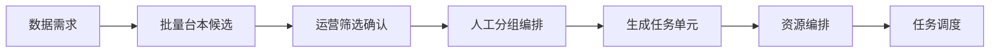

# V2.3.0 台本优先业务流设计规格

> 日期：2026-06-18  
> 状态：已落地（前端原型）

## 背景

V2.2.x 链路为「需求 → 任务单元 → 台本绑定」，任务单元先被拆出，导致批量台本生成与筛选只能逐个任务处理。

V2.3.0 改为：



## 核心对象

| 类型 | 说明 |
|------|------|
| `RequirementScriptBatch` | 一次从需求批量生成台本的批次记录 |
| `TaskScript`（扩展） | 增加 `requirementId`、`batchId`、`reviewStatus`、`generationMeta`、`recommendedTargetCount` |
| `Task`（扩展） | 增加 `scriptIds[]`、`scriptAllocations[]`、`pending_resources` 状态；保留 `scriptId` 兼容 |
| `ScriptTaskAllocation` | 台本 → 目标采集条数 |

## 任务单元生成规则

运营确认台本后进入**人工分组编排**，确认分组方案后再生成任务单元。系统按 `sceneId + propIds + taskType` 提供建议分组，运营可调整。生成任务单元时不指派人/设备；状态为 `pending_resources`，在任务列表完成资源编排后变为 `to_schedule`。

## 实现位置

| 模块 | 路径 |
|------|------|
| 数据模型 | `src/data/mock.ts` |
| 台本 ID / 采集条数访问 | `src/lib/taskScriptAccess.ts` |
| 批量工作流纯函数 | `src/lib/scriptBatchWorkflow.ts` |
| 拆解页 UI | `src/components/tasks/ScriptFirstDecomposition.tsx` |
| 就绪校验 | `src/lib/taskReadiness.ts` |
| 自动调度 | `src/lib/autoSchedule.ts` |
| 采集 App | `src/pages/CollectionApp.tsx` |

## 兼容策略

- 旧任务仅有 `scriptId` 时，`migrateLegacyTask()` 映射为 `scriptIds: [scriptId]`
- 就绪校验、调度、列表展示均通过 `taskScriptIds()` 统一读取

## 验收标准

1. 已审批需求可一键生成 10/30/50 条台本候选
2. 运营可确认/剔除候选，并为每条台本设置采集次数
3. 同场景、同道具、不同动作序列的台本合并为一个任务单元
4. 任务列表展示台本数与总采集条数
5. 调度前须全部绑定台本 confirmed + 人/设备/场地就绪
6. 采集 App 展示任务包内台本队列，按台本进入采集
7. 旧单台本任务仍可显示与调度

## 验证

```bash
npm run build
node scripts/validate-script-batch-workflow.mjs
```
